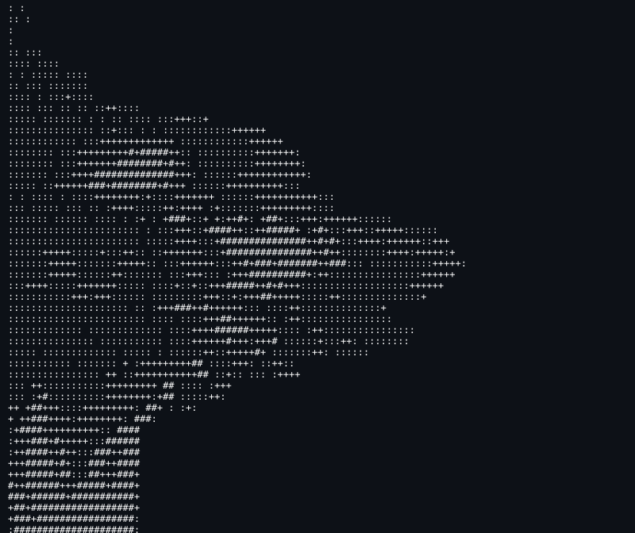

<h1 align="center">Hi! I'm Anshuman Mondal</h1>
<h2 align="center">Undergrad at IITG, India</h2>
<h3 align="center"> Majoring in Electronics and Communication Engineering </h3>

  

- 🌱 I’m currently learning **ML**

- 📫 Reach me at: **anshuman.mondal@iitg.ac.in**

  

  

  <a href="mailto:anshuman.mondal@iitg.ac.in">email</a> · 
  <a href="https://linkedin.com/in/anshu2k6">linkedin</a> · 
  <a href="https://github.com/anshumanmondal2006">github</a>

<h3 align="left">Connect with me:</h3>

<!--  -->

<h3 align="left">Languages and Tools:</h3>

        

